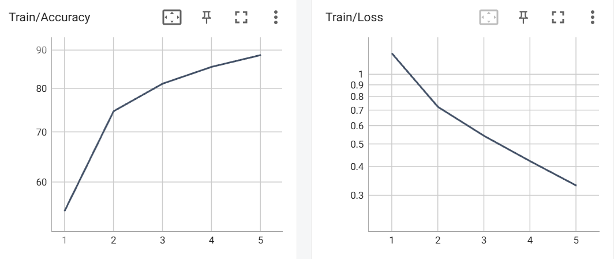
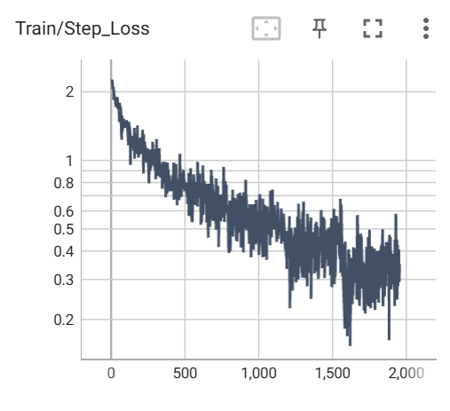
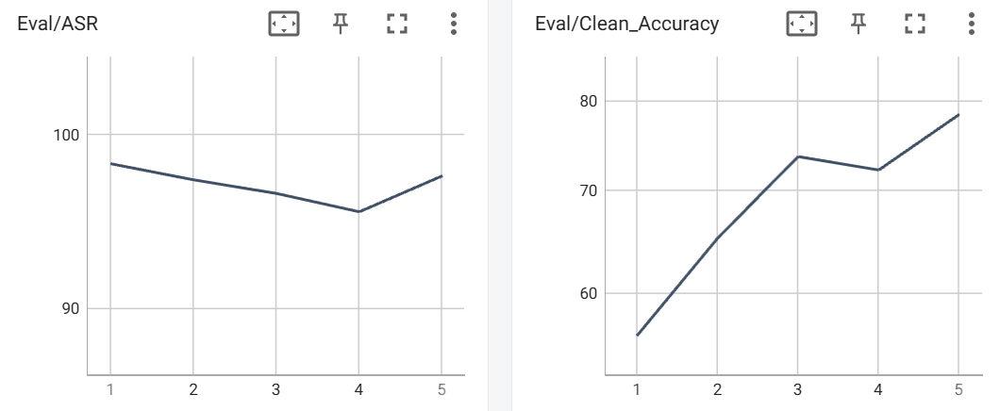
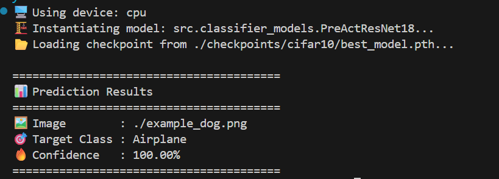

# Badnets

## Environment
See requirements.txt

## Run
使用默认的cifar10数据集和PreActResNet18模型，运行如下命令：
```bash
python main.py
```
更改datasets和model可以用命令行：
```bash
python train.py dataset=cifar10 model=densenet121
```
或者更改`config.yaml`文件
## Result
默认配置运行 5 epoch, 最终最佳结果为

"best_clean_acc": 78.42,
"best_asr": 97.51111111111112,
"best_epoch": 5

| Epoch | Train Loss | Train Acc | Clean Acc | ASR |
| :---: | :---: | :---: | :---: | :---: |
| 1 | 1.23 | 54.80% | 56.26% | 98.23% |
| 2 | 0.72 | 74.56% | 65.11% | 97.28% |
| 3 | 0.54 | 81.17% | 73.61% | 96.48% |
| 4 | 0.42 | 85.48% | 72.14% | 95.41% |
| 5 | 0.33 | 88.64% | 78.42% | 97.51% |

训练train的loss和acc, val的clean_acc和asr(poison_acc)原始值高精度结果见`metrics_raw.csv`

各曲线如下：





## Example




